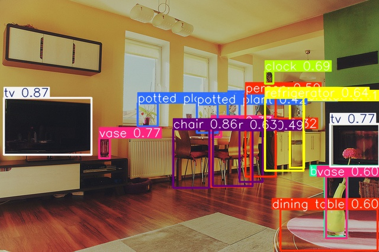

# AI 1.0/AI 2.0 推理实验报告
### 2022013009 陈烁宸 未央-微21

## 实验环境
| 项目             | 配置信息                          |
|------------------|-----------------------------------|
| 实验日期         | 02/28/2025                      |
| 处理器           | Intel(R) Xeon(R) Gold 6430          |
| GPU              | NVIDIA RTX4090-24G PCIe 5.0  x8       |
| 内存             | 920GB                     |
| 推理框架         | PyTorch 2.6.0 / Transformers 4.48.2 |
| 操作系统         | Ubuntu 20.04.6 LTS              |

## AI 1.0 目标检测实验
### 实验配置
```
Model: YOLOv5s (Ultralytics)
Hardware Acceleration: CUDA 12.4
Inference Framework: PyTorch 2.6.0
```

### 实验结果
#### 检测结果可视化


### 性能指标
| 指标            | 数值        |
|-----------------|-------------|
| 输入分辨率      | 640x426  |
| 检测目标数量    | 18         |
| 推理时间        | 0.16s    |
| 帧率 (FPS)      | 6.29    |
| GPU显存占用峰值   | 109.2 MB     |

## AI 2.0 对话任务实验
### 实验配置
```
Model: DialoGPT-medium (Microsoft)
Hardware Acceleration: CUDA 12.4
Inference Framework: Transformers 4.48.2
```

### 实验结果
**Prompts:**
```
1. Hello, how are you?
2. Tell me a joke about quantum physics.
3. Tell me some information of MIT.
4. What do you think happens after we die?
5. If you could time travel to any historical event, where would you go and why?
```

**Responses:**
```
1. I'm good, how are you?
2. What is the most beautiful thing you have ever seen?
3. I'm not sure what you mean by that.
4. We get to live forever.
5. I would go to the Battle of the Bulge.
```

### 性能指标
| 指标              | 数值        |
|-------------------|-------------|
| 总处理Prompt数    | 5         |
| 平均推理时间      | 0.15s     |
| 总生成token数     | 51    |
| Token生成速率     | 68.21 tokens/s |
| GPU显存占用峰值      | 1397.6 MB   |

## 作业源代码
https://github.com/shuochen0113/FSHT-for-AI
